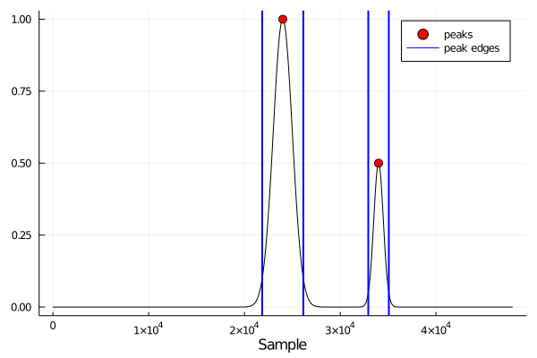
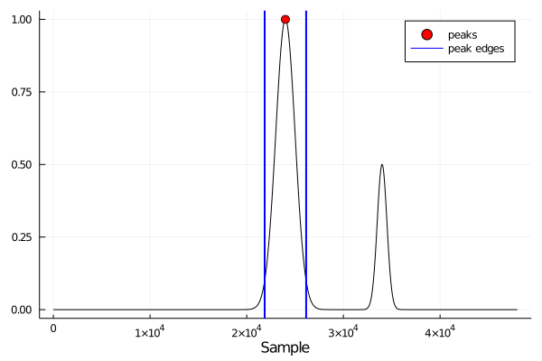

# FindPeaks1D
[](https://travis-ci.org/ymtoo/FindPeaks1D.jl)
[](https://codecov.io/gh/ymtoo/FindPeaks1D.jl)


Finding peaks in a 1-D signal in Julia. The implementation is based on [`find_peaks`](https://docs.scipy.org/doc/scipy/reference/generated/scipy.signal.find_peaks.html) in `SciPy`.

## Installation
```julia
using Pkg; pkg"add https://github.com/ymtoo/FindPeaks1D.jl.git"
```

## Usage
```julia
using FindPeaks1D, ImageFiltering, Plots

n = 48001
s1 = ImageFiltering.Kernel.gaussian((1000,), (n,))
s2 = ImageFiltering.Kernel.gaussian((500,), (n,))
s = s1.parent/maximum(s1.parent) + 0.5 * circshift(s2.parent/maximum(s2.parent), (10000,))
```
```julia
pkindices, properties = findpeaks1d(s; 
                                    height=0.1, 
                                    prominence=0.2, 
                                    width=1000.0, 
                                    relheight=0.9)

plot(s; color="black", label=false)
scatter!(pkindices, s[pkindices]; color="red", markersize=5, label="peaks")
vline!(properties["leftips"]; color="blue", width=2, label="peak edges")
vline!(properties["rightips"]; color="blue", width=2, label=false)
xlabel!("Sample")
```

```julia
pkindices, properties = findpeaks1d(s; 
                                    height=0.1, 
                                    distance=12000, 
                                    prominence=0.2, 
                                    width=1000.0, 
                                    relheight=0.9)

plot(s; color="black", label=false)
scatter!(pkindices, s[pkindices]; color="red", markersize=5, label="peaks")
vline!(properties["leftips"]; color="blue", width=2, label="peak edges")
vline!(properties["rightips"]; color="blue", width=2, label=false)
xlabel!("Sample")
```
